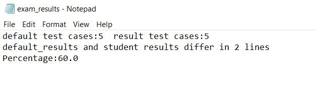

# Automation-of-HDL-Lab-evaluation-using-scripts(3 in 1 evaluation)
<h3>How to run using DESim Gui:</h3>

- Install DESim (37.5 MB) from fpgacademy github page.
- Create a clone of this repository in your local computer.
- If you open the folder you can see 3 verilog files. and_gate, and_tb and top module
- and_gate is written by student, and_tb and test cases are given by faculty, top module is used for DESim emulation which is for mapping and_gate pins with default DE1 soc DESim pins.
- Now open desim software and select and_gate folder by clicking open project.

- Compile Testbench
- Now modelsim software will open where student can show the waveforms.
- Make sure that <code>run -all</code> is clicked and exit modelsim.

- Now the 'results.txt' will be generated and it will be compared with 'default_results.txt'. (faculty can already follow the same procedure in the previous steps by writing correct code to generate 'result.txt' and he/she has to just rename that file for default test case results, 'default_results.txt')
- After comparing default_results with results python scripts written will generate the result.
- Exam results will be shown in the DESim gui as well as exam_results.txt. Screenshots attached below.( When student write wrong code and correct code)
 
- When student makes mistakes:

- Faculty will have a result copy inside sim folder.

- Student can also start simulation and show the hardware implementation emulation.

<h3>How to run using cmd promt</h3> 
- Open cmd promt in path <code>../test/name_of_the_experiment/sim</code> 
- type <code>run_compile</code> 
- When modelsim opens use run/run all button or type <code>run -all</code> in transcript 
- Close the modelsim window. 
- View your results in promt. 
  
